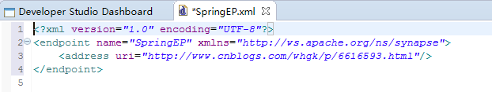

##Carbon Application的创建与发布

###eclipse创建Carbon Application

说明：Carbon Application是一个或者几个ESB Config Project的集合打包后结果。

例如：

    我们在eclipse中创建了以下几个ESB Config Project：

    MyESBProject1：
    MyESBProject2：
    MyESBProject3：

    经过打包后生成一个MyCompositeApplication_1.0.0.car的文件。

    将改文件Add到WSO2的Carbon Application下即可。

####创建一个ESB Config Project

我们可以创建一个ESB Config Project来保存所有与ESB相关的组件，如proxy service、Endpoint、Sequnence以及synapse configurations等。同理，我们也可以为每一个ESB相关的组件创建一个ESB Config Project。

创建ESB Config Project：

1. 打开Developer Studio Dashboard(单击Developer Studio > Open Dashboard)，在Integration Project类别中点击ESB Config Project。

    其过程如下两个图：

    

    

2. 如果想从现有的配置文件创建此ESB项目，请选择Point to Existing Synapse-configs Folder。否则，选择New ESB Config Project。单击Next。
    
    

3. 执行以下操作:

    + 输入项目名称；
    + 若选择的是New ESB Config Project，点击Finish完成项目的创建；
    + 若选择的是Point to Existing Synapse-configs Folder，点击Browse选择文件，点击finish完成项目的创建。

    现在新项目已经在工作区中创建。浏览项目，将看到如下图所示的项目结构，新创建的项目已经为不同的资源创建了文件夹，例如endpoint、 local entries、 proxy services和sequence等。

    

###创建一个Endpoint

端点是发送消息的服务的地址。通常，端点是代理服务的地址，代理服务充当实际服务的前端。

我们可以创建一个新的endpoint，或者从XML文件中导入现有的endpoint，例如一个Synapse配置文件。

1. 打开Developer Studio Dashboard(单击Developer Studio > Open Dashboard)，在Integration Project类别中点击Endpoint；
2. 选择Create a New Endpoint 并点击Next.
3. 输入endpoint名称，以及address，点击Finish完成创建。
    
    

4. 创建完成后的endpoint如下：

    

###创建一个REST API
1. 打开Developer Studio Dashboard(单击Developer Studio > Open Dashboard)，在Integration Project类别中点击REST API；

    

    

2. 输入Name、Context，并选择Save location。其中Context是经过代理之后访问路径中的一部分

    

3. APIs中可以包含多个Resource，每一个Resource中包含一个需要代理的端点，单击Resource

    

    该Resource的properties如下如所示：

    

    设置该Resource的Properties，设置Uri Style、URI-Template、Method，此处设置Method为Get方法，如下图所示：

    

4. 为Resource添加Mediator，直接从Palette中拖拽到右侧的绘画板中即可，如下如所示：

    

5. 在send中添加Endpoint，此处添加HTTP Endpoint

    

6. 单击Http-EP，在properties中设置URI Template、Http Method，其中URI Template设置为http://platform.bzhis.com:7200/api//catalogs/{uri.var.personId}，其中{uri.var.personId}为在访问时需要传输进来的参数或路径
    
    

7. 完成REST API的创建，如下两个图所示：

    

    

###将ESB组件打包成可部署文件

####创建Compostie Application Project

1. 现在可以创建一个组合应用程序来组合这些工件。创建一个Compostie Application Project， 在Project Explorer点击右键，选择 New -> Project，选择Composite Application Project，点击Next。

    

    

2. 填写项目名，在此可以选择需要组合进来的Project，也可以在创建之后打开pom.XML文件，在Dependencies中将看到我们所选择的每个项目的信息，例如服务器角色和版本。在编辑器中，可以更改这些细节。

    

    

####创建CAR文件

1. 在已创建的CompositeApplication项目上右键，选择Export Composite Application Project，

     

    

    

点击Finish完成。

2.  在D:\WSO2workspace\eclipseWorkspace（本机路径）中即可看到我们刚才打包过的car文件
    
    
    

###部署car文件到Carbon Application

1. 在WSO2平台下，Main>manage>Carbon Application，点击Add
2. 上传之前打包后的car文件，选择car文件后点击Upload

    

3. 刷新页面，发现我们上传的carbon application出现错误，我们查看出错信息

    

   从出错信息中可以看出catalogsIDAPI重复定义，所以在这里需要注意的是，在WSO2中定义的API等均需要有唯一的名称，不允许出现重复定义的情况，否则car文件会上传失败。

4. 修改重复的信息
5. 重新打包car文件，重新上传到WSO2。
6. 上传成功

    

###访问部署到WSO2上ESB组件

1. 查看访问路径

    

    在该访问路径之后添加之前创建REST API是填写的Context：/catalogs/{personId}

    访问结果如下如所示：

    
