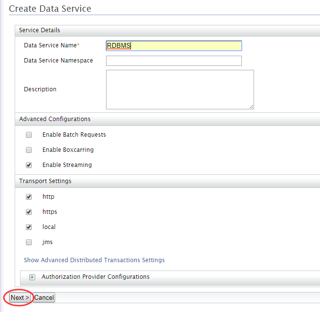
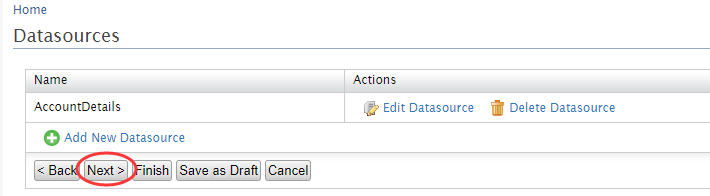
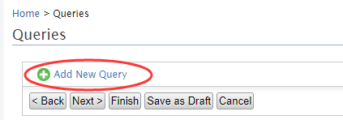
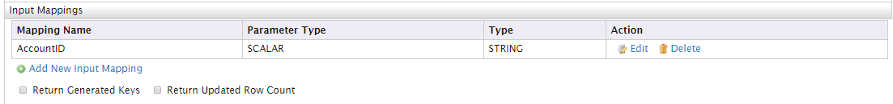
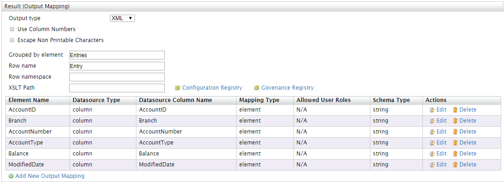
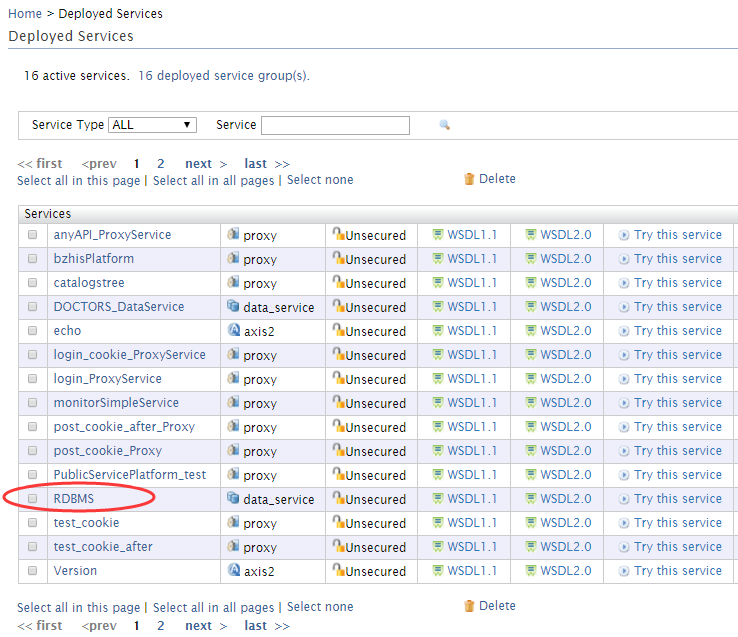

#将RDBMS作为数据服务公开

###步骤1:设置RDBMS

3. 创建数据库trainingdb；
4. 创建如下表：

        CREATE TABLE ACCOUNT(AccountID int NOT NULL,Branch varchar(255) NOT NULL, AccountNumber varchar(255),AccountType ENUM('CURRENT', 'SAVINGS') NOT NULL,Balance FLOAT,ModifiedDate DATE,PRIMARY KEY (AccountID)); 

5. 将下列数据输入表格:

        INSERT INTO ACCOUNT VALUES (1,"AOB","A00012","CURRENT",231221,'2014-12-02');

***

###步骤2:添加RDBMS数据源

1. 登录到管理控制台并在Data Service中选择Create；
2. 在Create Data Service屏幕中，输入RDBMS作为数据服务名称。单击Next，进入下一步；

    

3. 添加新数据源，并输入以下详细信息: 

    Datasource ID  : AccountDetails

    Datasource type: RDBMS

    Database Engine: Select MySQL

    URL:  jdbc:mysql://localhost:3306/trainingdb 

4. 在URL字段中输入MySQL数据库的URL。
5. 输入用户名和密码，以连接到MySQL数据库
   
    

    注意：确保MySQL的JDBC驱动程序已经复制到您的< EI_HOME > / lib目录下，复制后请重新启动WSO2，否则会报'Cannot load JDBC driver class com.mysql.jdbc.Driver'错误

    点击Test Connection测试连接数据库是否成功。

    

***

###步骤3:定义查询
现在，让我们开始编写用于从数据源获取数据的查询。

1. 单击Add New Query打开添加新查询页面。

    点击Next

    

    点击Add New Query

    

2. 输入以下值：

        Query ID: 输入查询ID；

        Datasource: 选择数据源，选择之前创建的RDBMS数据源——AccountDetails；

        SQL: 输入框中输入SQL语句；

        SELECT AccountID,Branch,AccountNumber,AccountType,Balance,ModifiedDate FROM ACCOUNT WHERE AccountID=:AccountID

3. 添加输入映射

    单击Generate Input Mapping自动为数据库中的AccountID字段创建映射。

    

    

4. 添加输出映射:单击Generate Response自动创建应该在输出中显示的字段的映射。
    
    
    
    

5. 单击Save，然后单击Next，打开操作界面。

***

###步骤4:定义调用查询的操作
1. 单击添加Add New Operation以打开添加新的操作界面。
2. 在操作名称字段中为新操作添加一个名称。
3. 在Query ID字段中，选择先前定义的查询。
4. 保存该操作。

***

###步骤5:完成Data Service的创建   
1. 操作定义完成后，单击Finish完成Data Service的创建过程。将在已部署的服务列表中看见我们刚才创建的Data Service。

    

***

###步骤6:调用您的数据服务

1. 去到Deployed Services页面
2. 点击RDBMS的Try this service，TryIt工具将打开数据服务。
3. 选择刚才创建的操作，在account ID处输入“1”；
4. 点击Send，查看account的详细信息。

    

定义完后的Data Service的XML如下：

    <data name="RDBMS" transports="http https local">
        <config enableOData="false" id="AccountDetails">
            <property name="driverClassName">com.mysql.jdbc.Driver</property>
            <property name="url">jdbc:mysql://localhost:3306/trainingdb</property>
            <property name="username">root</property>
            <property name="password">123456</property>
        </config>
        <query id="QueryByAccountID" useConfig="AccountDetails">
            <sql>SELECT AccountID,Branch,AccountNumber,AccountType,Balance,ModifiedDate FROM ACCOUNT WHERE AccountID=:AccountID</sql>
            <result element="Entries" rowName="Entry">
                <element column="AccountID" name="AccountID" xsdType="string"/>
                <element column="Branch" name="Branch" xsdType="string"/>
                <element column="AccountNumber" name="AccountNumber" xsdType="string"/>
                <element column="AccountType" name="AccountType" xsdType="string"/>
                <element column="Balance" name="Balance" xsdType="string"/>
                <element column="ModifiedDate" name="ModifiedDate" xsdType="string"/>
            </result>
            <param name="AccountID" sqlType="STRING"/>
        </query>
        <operation name="OperationQueryAccountID">
            <call-query href="QueryByAccountID">
                <with-param name="AccountID" query-param="AccountID"/>
            </call-query>
        </operation>
    </data>

***

##利用postman发送请求，访问RDBMS数据服务

####1、查看代理后的uri

点击Deployed Services页面中的RDBMS，进入RDBMS的Service Dashboard页面，查看代理后的访问路径。

####2、打开postman，输入请求。

    在Body中输入请求：

        <p:OperationQueryAccountID xmlns:p="http://ws.wso2.org/dataservice">
            <!--Exactly 1 occurrence-->
            <xs:AccountID xmlns:xs="http://ws.wso2.org/dataservice">1</xs:AccountID>
        </p:OperationQueryAccountID>

访问结果如下：

