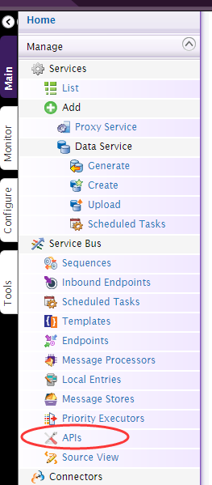
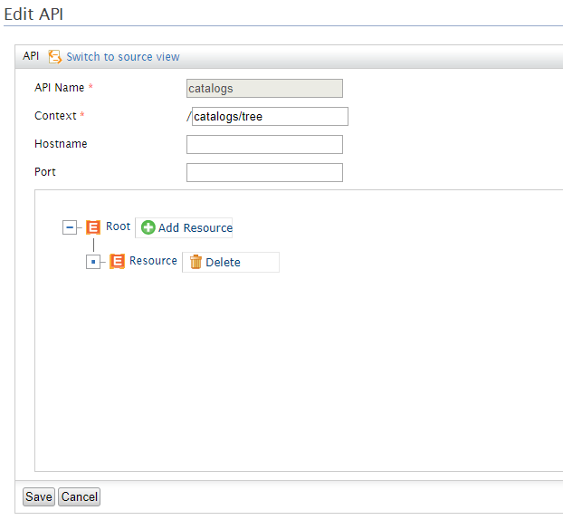
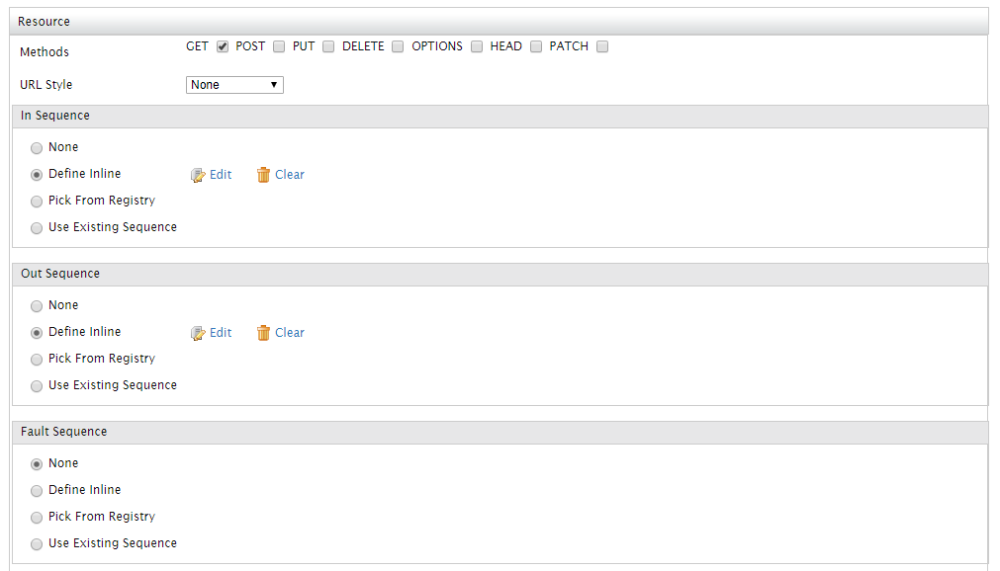
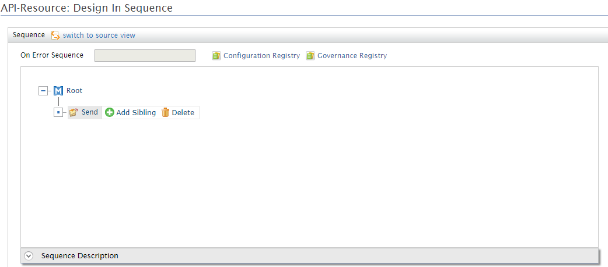
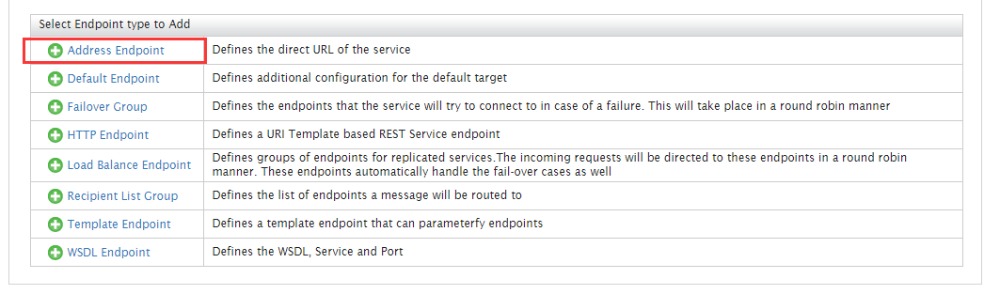
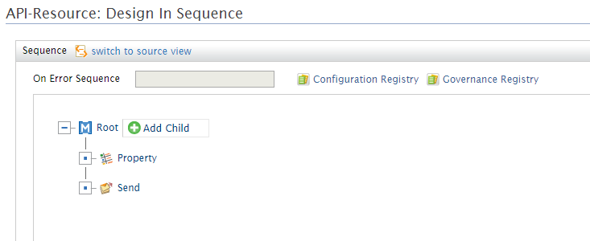
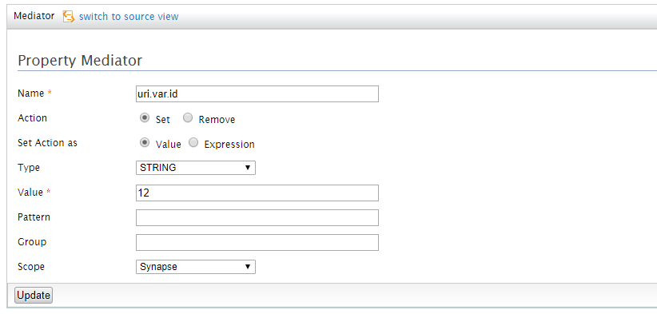
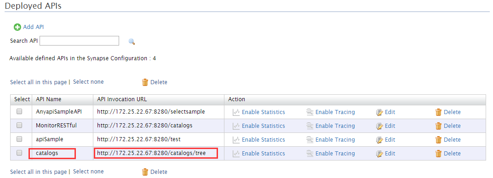
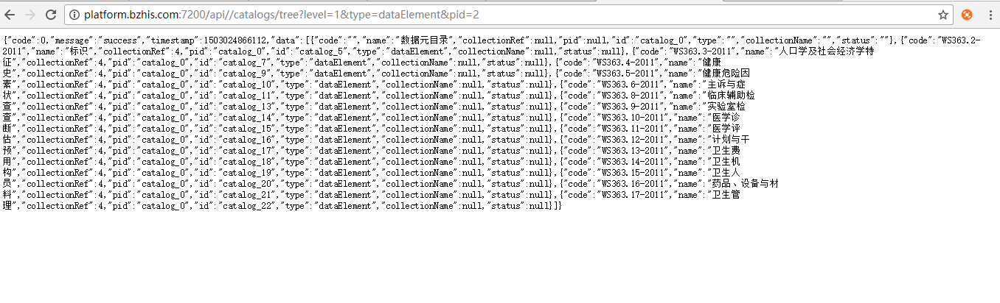

#RESTful的接入和使用

RESTful接入WSO2，创建APIs

###类型1：创建Endpoint为Address Endpoint类型的APIs
1. Add APIs
    
    

    进入Deployed APIs页面，点击Add API。

    

2. 进入Add API页面，编辑API，输入API name、Context。

    catalogs/tree就是访问路径中的一部分

    

3. 添加Resource，点击Add Resource

    

4. 为RNS RESTful API中http://platform.bzhis.com:7200/api//catalogs/tree创建API,

    

    编辑Resource，勾选GET方法

    

 5. 编辑InSequence

    进入API-Resource: Design In Sequence页面，编辑InSequence

    

    

 6. 添加Address Endpoint，定义服务的直接URL，在编辑页面中直接添加URL地址即可

    

    

    依次保存。

7. 编辑OutSequence

    保存并完成，编辑后的API的XML文件如下：

        <api xmlns="http://ws.apache.org/ns/synapse" name="catalogs" context="/catalogs/tree">
            <resource methods="GET">
                <inSequence>
                    <send>
                        <endpoint>
                            <address uri="http://platform.bzhis.com:7200/api//catalogs/tree"/>
                        </endpoint>
                    </send>
                </inSequence>
                <outSequence>
                    <send/>
                </outSequence>
            </resource>
        </api>
       
 

###种类2：创建Endpoint为HTTP Endpoint类型的APIs
    
定义该类型的前五个步骤同上；

6. Endpoint，定义一个基于REST服务的URI模板的端点，此处我们以http://platform.bzhis.com:7200/api//catalogs/{id}为模板，添加EndPoint

    

7. 定义完HTTP Endpoint后，需要在 Design In Sequence中添加Property，为{uri.var.id}赋值，才能组成完整的URI。

    

    

    依次保存完成。

8. 同种类1的第七步。

    保存并完成，编辑后的API的XML文件如下：
    
        <api xmlns="http://ws.apache.org/ns/synapse" name="MonitorRESTful" context="/catalogs">
            <resource methods="PUT DELETE GET">
            <inSequence>
                <property name="uri.var.id" value="12" scope="default" type="STRING"/>
                <send>
                    <endpoint>
                        <http method="GET" uri-template="http://platform.bzhis.com:7200/api//catalogs/{uri.var.id}"/>
                    </endpoint>
                </send>
            </inSequence>
            <outSequence>
                <log level="custom">
                    <property name="Character" expression="get-property('uri.var.id')"/>
                </log>
                <send/>
            </outSequence>
        </resource>
    </api>
    

###步骤2：访问代理后的API

1. 我们可以在Deployed APIs页面中看见我们刚才创建的API及代理后的访问路径

    

2. 访问代理后的路径。
    
    通过postman访问：
    

    通过浏览器访问：
    

    通过postman带参数访问：
    

    通过浏览器带参数访问：
    

