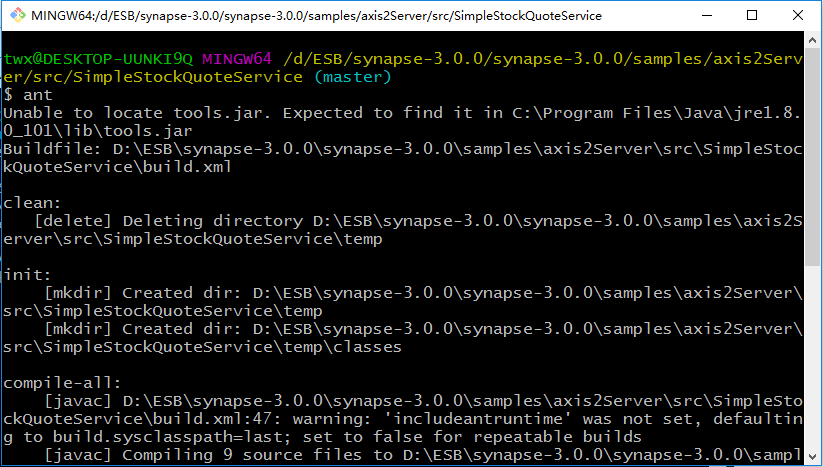
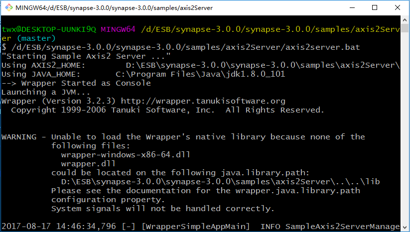
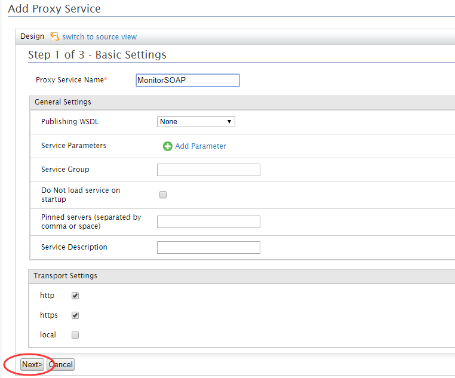
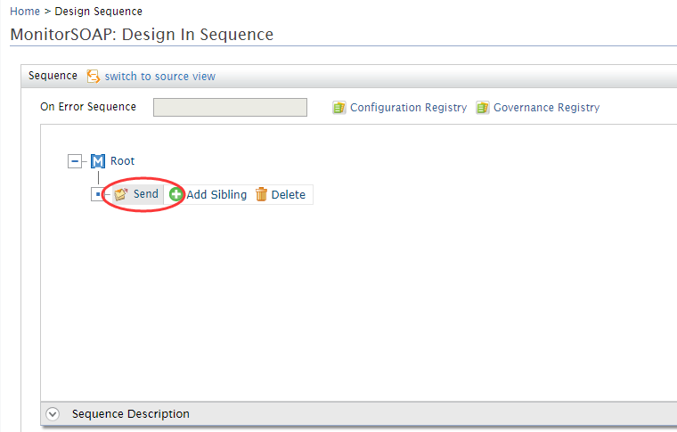
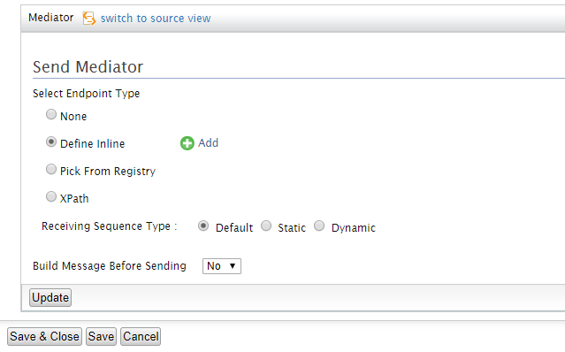
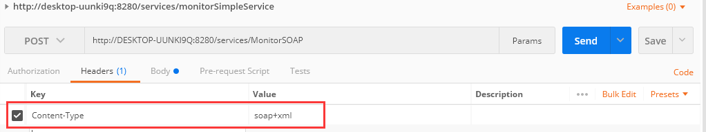
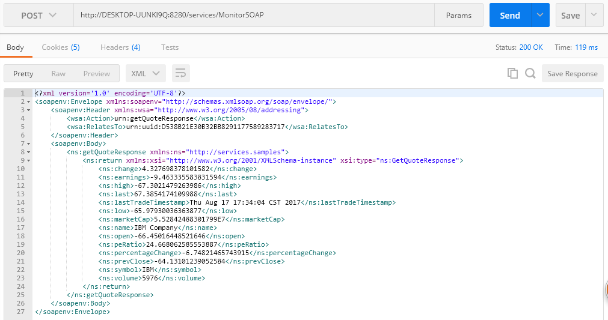

#SOAP协议系统的接入

启用Synapse示例中的SOAP服务，模拟SOAP系统接入WSO2，代理服务

说明：

1. Apache Synapse是一个轻量级的高性能企业服务总线(ESB)。Synapse包中包含大量示例及示例服务，其中就包含SOAP协议的服务。

2. 只要是SOAP协议的服务即可，这里使用Synapse中的示例服务只是方便作为例子进行模拟。

###步骤1：启动Synapse示例服务

1. 启动{SYNAPSE_HOME}\samples\axis2Server\src\SimpleStockQuoteService目录下，运行该服务。本机的{SYNAPSE_HOME}为Synapse的安装目录（D:\ESB\synapse-3.0.0\synapse-3.0.0）

    在该目录下执行命令行：ant

    
 
2. 启动axis2server，至{SYNAPSE_HOME}\samples\axis2Server目录下，

    在该目录下执行命令行：
    Linux/Unix：axis2server.sh
    Windows:axis2server.bat

    

3. 至此已启动Synapse的示例服务。

***

###步骤2：SOAP服务接入到WSO2

####直接Add——>Proxy Service

1. 自定义代理服务

    

2. 自定义代理服务，在Proxy Service Name处输入代理服务的名称，

    

    点击Next进入In Sequence and Endpoint Options页面；

3. 在In Sequence and Endpoint Options页面中可以定义Sequence或者定义Endpoint，在此我们有以下几种方法定义Sequence：
    
    + None：不定义Sequence；
    + Define Inline：直接定义在Proxy Service中；
    + Pick from Registry：从已注册的Sequence中选择；
    + Use Existing Sequence ：使用现有的Sequence。

    
    
    此处我们选择Define Inline方式定义，点击Edit，进入Design In Sequence页面

4. 在Design In Sequence页面编辑Sequence，在Sequence中定义Endpoint。
    首先，添加send，点击send，在Send Mediator中添加Endpoint。

    

5. 在Send Mediator中添加Endpoint，点击Add，进入Create Anonymous Endpoint页面

    
    
6. 在此，我们选择Address Endpoint
    
    

    点击Address Endpoint，进入编辑页面

    

    点击Save & Close保存并关闭。

7. 依次保存Send Mediator、Design In Sequence并关闭，就回到In Sequence and Endpoint Options页面。点击Next，进入下一步：
    
    

8. 进入Out Sequence and Fault Sequence Options页面，同编辑insequence一样编辑outsequence即可。outsequence中不需要编辑endpoint。

9. 单击Finish完成Proxy Service的创建过程。将在已部署的服务列表中看见我们刚才创建的ProxyService。

    

    

创建完成后MonitorSOAP的XML文件如下：

    <?xml version="1.0" encoding="UTF-8"?>
        <proxy xmlns="http://ws.apache.org/ns/synapse"
            name="MonitorSOAP"
            startOnLoad="true"
            statistics="disable"
            trace="disable"
            transports="http,https">
            <target>
                <inSequence>
                    <send>
                        <endpoint>
                            <address uri="http://localhost:9000/services/SimpleStockQuoteService"/>
                        </endpoint>
                    </send>
                </inSequence>
                <outSequence>
                    <send/>
                </outSequence>
            </target>
            <description/>
        </proxy>

###步骤3：调用代理后的SOAP服务

1. 查看代理后的uri

    点击Deployed Services页面中的MonitorSOAP，进入MonitorSOAP的Service Dashboard页面，查看代理后的访问路径。

    

    

2. 使用postman访问代理后的服务

    Body中输入请求：

        <?xml version='1.0' encoding='UTF-8'?>
        <soapenv:Envelope xmlns:wsa="http://www.w3.org/2005/08/addressing" xmlns:soapenv="http://schemas.xmlsoap.org/soap/envelope/">
            <soapenv:Header>
                <wsa:To>http://localhost:9000/services/SimpleStockQuoteService</wsa:To>
                <wsa:MessageID>urn:uuid:D538B21E30B32BB8291177589283717</wsa:MessageID>
                <wsa:Action>urn:getQuote</wsa:Action>
            </soapenv:Header>
            <soapenv:Body>
                <m0:getQuote xmlns:m0="http://services.samples">
                <m0:request>
                <m0:symbol>IBM</m0:symbol>
                </m0:request>
                </m0:getQuote>
            </soapenv:Body>
        </soapenv:Envelope>

    设置Header
    
    

3. 发送请求，请求结果如下：

    

