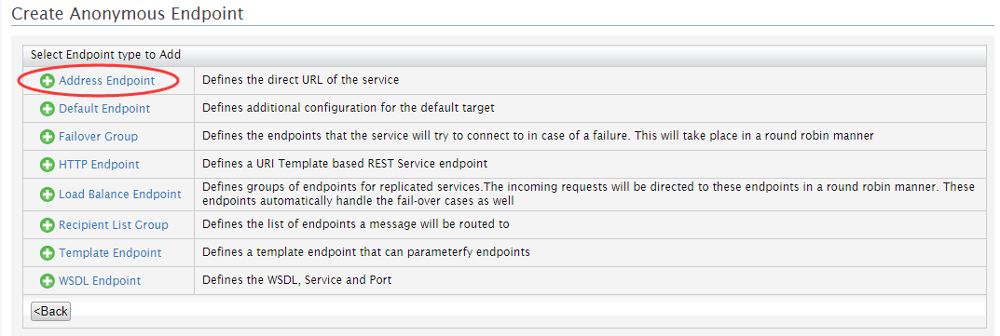
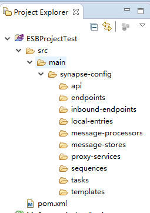
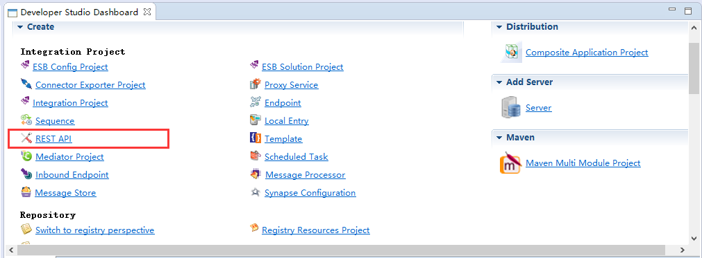
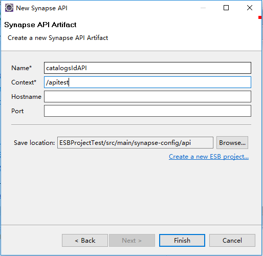
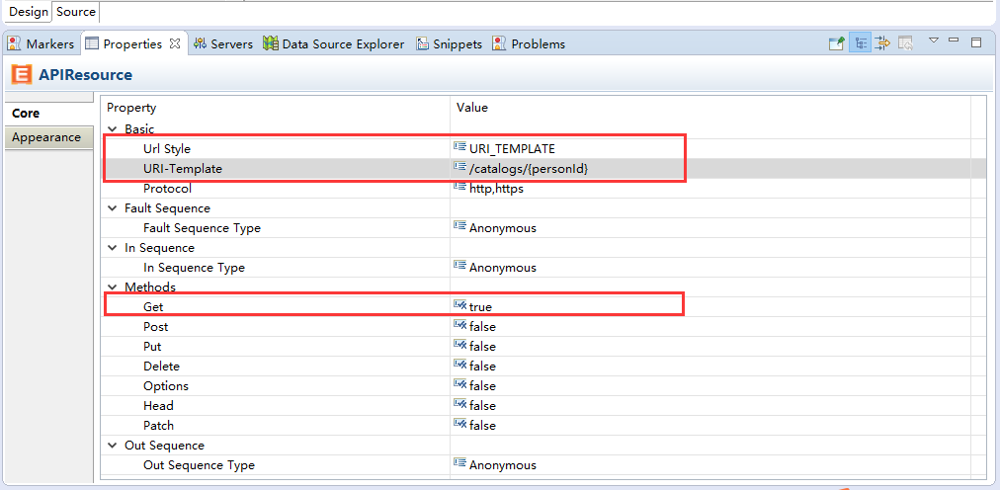
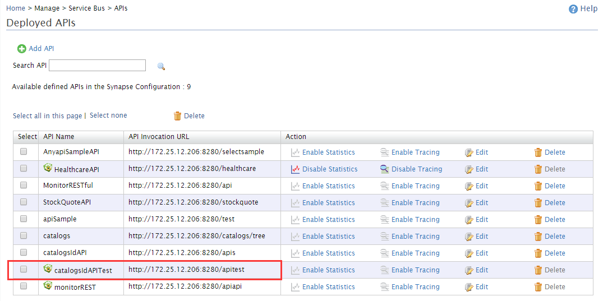

# ESB系统接入手册

>说明：本文档的前三部分内容：RESTful的接入和使用、将RDBMS作为数据服务公开、SOAP协议系统的接入均是在WSO平台上创建的，由于在WSO2平台上直接创建的内容没有一个统一的管理，所以我们需要第四部分的内容——Carbon Application的创建与发布，利用eclipse创建ESB Project，ESB Project中可以创建Endpoint、Sequence、Proxy Service、APIs等，而且可以创建多个ESB Project，最后可以对多个ESB Project进行打包生成Carbon Application，最后将生成的CAR文件部署到WSO2平台.
<!-- MarkdownTOC -->

- [WSO2：RESTful的接入和使用](#wso2%EF%BC%9Arestful%E7%9A%84%E6%8E%A5%E5%85%A5%E5%92%8C%E4%BD%BF%E7%94%A8)
    - [步骤1：RESTful接入WSO2，创建APIs](#%E6%AD%A5%E9%AA%A41%EF%BC%9Arestful%E6%8E%A5%E5%85%A5wso2%EF%BC%8C%E5%88%9B%E5%BB%BAapis)
        - [类型1：创建Endpoint为Address Endpoint类型的APIs](#%E7%B1%BB%E5%9E%8B1%EF%BC%9A%E5%88%9B%E5%BB%BAendpoint%E4%B8%BAaddress-endpoint%E7%B1%BB%E5%9E%8B%E7%9A%84apis)
        - [类型2：创建Endpoint为HTTP Endpoint类型的APIs](#%E7%B1%BB%E5%9E%8B2%EF%BC%9A%E5%88%9B%E5%BB%BAendpoint%E4%B8%BAhttp-endpoint%E7%B1%BB%E5%9E%8B%E7%9A%84apis)
        - [补充说明](#%E8%A1%A5%E5%85%85%E8%AF%B4%E6%98%8E)
    - [步骤2：访问代理后的API](#%E6%AD%A5%E9%AA%A42%EF%BC%9A%E8%AE%BF%E9%97%AE%E4%BB%A3%E7%90%86%E5%90%8E%E7%9A%84api)
- [WSO2：将RDBMS作为数据服务公开](#wso2%EF%BC%9A%E5%B0%86rdbms%E4%BD%9C%E4%B8%BA%E6%95%B0%E6%8D%AE%E6%9C%8D%E5%8A%A1%E5%85%AC%E5%BC%80)
    - [步骤1:设置RDBMS（以MySQL数据库为例）](#%E6%AD%A5%E9%AA%A41%E8%AE%BE%E7%BD%AErdbms%EF%BC%88%E4%BB%A5mysql%E6%95%B0%E6%8D%AE%E5%BA%93%E4%B8%BA%E4%BE%8B%EF%BC%89)
    - [步骤2:添加RDBMS数据源](#%E6%AD%A5%E9%AA%A42%E6%B7%BB%E5%8A%A0rdbms%E6%95%B0%E6%8D%AE%E6%BA%90)
    - [步骤3:定义查询](#%E6%AD%A5%E9%AA%A43%E5%AE%9A%E4%B9%89%E6%9F%A5%E8%AF%A2)
    - [步骤4:定义调用查询的操作](#%E6%AD%A5%E9%AA%A44%E5%AE%9A%E4%B9%89%E8%B0%83%E7%94%A8%E6%9F%A5%E8%AF%A2%E7%9A%84%E6%93%8D%E4%BD%9C)
    - [步骤5:完成Data Service的创建](#%E6%AD%A5%E9%AA%A45%E5%AE%8C%E6%88%90data-service%E7%9A%84%E5%88%9B%E5%BB%BA)
    - [步骤6:调用您的数据服务](#%E6%AD%A5%E9%AA%A46%E8%B0%83%E7%94%A8%E6%82%A8%E7%9A%84%E6%95%B0%E6%8D%AE%E6%9C%8D%E5%8A%A1)
    - [利用postman发送请求，访问RDBMS数据服务](#%E5%88%A9%E7%94%A8postman%E5%8F%91%E9%80%81%E8%AF%B7%E6%B1%82%EF%BC%8C%E8%AE%BF%E9%97%AErdbms%E6%95%B0%E6%8D%AE%E6%9C%8D%E5%8A%A1)
        - [1、查看代理后的uri](#1%E3%80%81%E6%9F%A5%E7%9C%8B%E4%BB%A3%E7%90%86%E5%90%8E%E7%9A%84uri)
        - [2、打开postman，输入请求。](#2%E3%80%81%E6%89%93%E5%BC%80postman%EF%BC%8C%E8%BE%93%E5%85%A5%E8%AF%B7%E6%B1%82%E3%80%82)
    - [补充说明](#%E8%A1%A5%E5%85%85%E8%AF%B4%E6%98%8E-1)
- [WSO2：SOAP协议系统的接入](#wso2%EF%BC%9Asoap%E5%8D%8F%E8%AE%AE%E7%B3%BB%E7%BB%9F%E7%9A%84%E6%8E%A5%E5%85%A5)
    - [步骤1：启动Synapse示例服务](#%E6%AD%A5%E9%AA%A41%EF%BC%9A%E5%90%AF%E5%8A%A8synapse%E7%A4%BA%E4%BE%8B%E6%9C%8D%E5%8A%A1)
    - [步骤2：SOAP服务接入到WSO2](#%E6%AD%A5%E9%AA%A42%EF%BC%9Asoap%E6%9C%8D%E5%8A%A1%E6%8E%A5%E5%85%A5%E5%88%B0wso2)
        - [直接Add——>Proxy Service](#%E7%9B%B4%E6%8E%A5add%E2%80%94%E2%80%94proxy-service)
    - [步骤3：调用代理后的SOAP服务](#%E6%AD%A5%E9%AA%A43%EF%BC%9A%E8%B0%83%E7%94%A8%E4%BB%A3%E7%90%86%E5%90%8E%E7%9A%84soap%E6%9C%8D%E5%8A%A1)
- [Eclipse：Carbon Application的创建与发布](#eclipse%EF%BC%9Acarbon-application%E7%9A%84%E5%88%9B%E5%BB%BA%E4%B8%8E%E5%8F%91%E5%B8%83)
    - [eclipse创建Carbon Application](#eclipse%E5%88%9B%E5%BB%BAcarbon-application)
        - [创建一个ESB Config Project](#%E5%88%9B%E5%BB%BA%E4%B8%80%E4%B8%AAesb-config-project)
    - [创建一个Endpoint](#%E5%88%9B%E5%BB%BA%E4%B8%80%E4%B8%AAendpoint)
    - [创建一个REST API](#%E5%88%9B%E5%BB%BA%E4%B8%80%E4%B8%AArest-api)
    - [将ESB组件打包成可部署文件](#%E5%B0%86esb%E7%BB%84%E4%BB%B6%E6%89%93%E5%8C%85%E6%88%90%E5%8F%AF%E9%83%A8%E7%BD%B2%E6%96%87%E4%BB%B6)
        - [创建Compostie Application Project](#%E5%88%9B%E5%BB%BAcompostie-application-project)
        - [创建CAR文件](#%E5%88%9B%E5%BB%BAcar%E6%96%87%E4%BB%B6)
    - [部署car文件到Carbon Application](#%E9%83%A8%E7%BD%B2car%E6%96%87%E4%BB%B6%E5%88%B0carbon-application)
    - [访问部署到WSO2上ESB组件](#%E8%AE%BF%E9%97%AE%E9%83%A8%E7%BD%B2%E5%88%B0wso2%E4%B8%8Aesb%E7%BB%84%E4%BB%B6)

<!-- /MarkdownTOC -->

## WSO2：RESTful的接入和使用

### 步骤1：RESTful接入WSO2，创建APIs

#### 类型1：创建Endpoint为Address Endpoint类型的APIs
1. Add APIs
    
    

    进入Deployed APIs页面，点击Add API。

    

2. 进入Add API页面，编辑API，输入API name、Context。

    catalogs/tree就是访问路径中的一部分

    

3. 添加Resource，点击Add Resource

    

4. 为RNS RESTful API中http://platform.bzhis.com:7200/api//catalogs/tree创建API,

    

    编辑Resource，勾选GET方法

    

5. 编辑InSequence

    进入API-Resource: Design In Sequence页面，编辑InSequence

    

    

6. 添加Address Endpoint，定义服务的直接URL，在编辑页面中直接添加URL地址即可

    

    

    依次保存。

7. 编辑OutSequence

    保存并完成，编辑后的API的XML文件如下：

        <api xmlns="http://ws.apache.org/ns/synapse" name="catalogs" context="/catalogs/tree">
            <resource methods="GET">
                <inSequence>
                    <send>
                        <endpoint>
                            <address uri="http://platform.bzhis.com:7200/api//catalogs/tree"/>
                        </endpoint>
                    </send>
                </inSequence>
                <outSequence>
                    <send/>
                </outSequence>
            </resource>
        </api>
       

#### 类型2：创建Endpoint为HTTP Endpoint类型的APIs
    
定义该类型的前五个步骤同上；

6. Endpoint，定义一个基于REST服务的URI模板的端点，此处我们以http://platform.bzhis.com:7200/api//catalogs/{id}为模板，添加EndPoint

    

7. 定义完HTTP Endpoint后，需要在 Design In Sequence中添加Property，为{uri.var.id}赋值，才能组成完整的URI。

    

    

    依次保存完成。

8. 同种类1的第七步。

    保存并完成，编辑后的API的XML文件如下：
    
        <api xmlns="http://ws.apache.org/ns/synapse" name="MonitorRESTful" context="/catalogs">
            <resource methods="PUT DELETE GET">
            <inSequence>
                <property name="uri.var.id" value="12" scope="default" type="STRING"/>
                <send>
                    <endpoint>
                        <http method="GET" uri-template="http://platform.bzhis.com:7200/api//catalogs/{uri.var.id}"/>
                    </endpoint>
                </send>
            </inSequence>
            <outSequence>
                <log level="custom">
                    <property name="Character" expression="get-property('uri.var.id')"/>
                </log>
                <send/>
            </outSequence>
        </resource>
    </api>

####补充说明

1. property的使用问题    

    创建HTTPEndpoint类型的APIs，如果需要在访问的URL中读取参数，例如，在访问过程中需要输入参数的情况下，我们需要从访问的URL中读取参数名传递给Endpoint，这就涉及到property的使用。

    property有以下两种取值方式：

    （1）value：直接赋值

    例：
        
        <property name="uri.var.token" value="53D1F44FBEAF492F91BAB325E958DB1A" scope="default" type="STRING"/>

    （2）expression：

    例：
        
        <property name="uri.var.token" expression="$url:token" scope="default" type="STRING"/>

    以上expression的取值方式中，需要注意的是name="uri.var.token"和expression="$url:token" 

    例如：将以下URL定义为APIs

        https://localhost:8080/v1.0/access/token/get?userName=123&password=123456

    url-template、property以及HTTPEndpoint的定义方式对应如下图所示：

    

2. URL中传递的参数包含日期的问题

    在代理路径的输入参数中含有日期等其中包含空格的参数时，需要对其进行Decode。
    如下面例子所示：

    例子：
    
    >http://localhost/demo/v1.0/data?startTime=2017-05-17 10:01:30

    输入的参数为startTime：2017-05-17 10:01:30

    该例子，在访问时会对2017-05-17 10:01:30进行编码，将其变为2017-05-17%2010:01:30，所以经过代理之后再输入参数进行访问时，就会出现404错误。

    解决方法：

    在WSO2中定义API时，按正常（参数中不含有空格）来说resource的url-template可以定义为:/data/?startTime={startTime}，但此时需要对startTime进行Decode，在WSO2中仅需要将url-template定义为/data/?startTime={+startTime}即可。

### 步骤2：访问代理后的API

1. 我们可以在Deployed APIs页面中看见我们刚才创建的API及代理后的访问路径

    

2. 访问代理后的路径。
    
    通过postman访问：
    

    通过浏览器访问：
    

    通过postman带参数访问：
    

    通过浏览器带参数访问：
    

## WSO2：将RDBMS作为数据服务公开

### 步骤1:设置RDBMS（以MySQL数据库为例）

1. 创建数据库trainingdb；
2. 创建如下表：

        CREATE TABLE ACCOUNT(AccountID int NOT NULL,Branch varchar(255) NOT NULL, AccountNumber varchar(255),AccountType ENUM('CURRENT', 'SAVINGS') NOT NULL,Balance FLOAT,ModifiedDate DATE,PRIMARY KEY (AccountID)); 

3. 将下列数据输入表格:

        INSERT INTO ACCOUNT VALUES (1,"AOB","A00012","CURRENT",231221,'2014-12-02');

***

### 步骤2:添加RDBMS数据源

1. 登录到管理控制台并在Data Service中选择Create；
2. 在Create Data Service屏幕中，输入RDBMS作为数据服务名称。

    

    单击Next，进入下一步，添加数据源；

    

3. 添加新数据源，并输入以下详细信息: 

    Datasource ID  : AccountDetails

    Datasource type: RDBMS

    Database Engine: Select MySQL

    URL:  jdbc:mysql://localhost:3306/trainingdb 

4. 在URL字段中输入MySQL数据库的URL。
5. 输入用户名和密码，以连接到MySQL数据库
   
    

    点击Test Connection测试连接数据库是否成功。

    

***

### 步骤3:定义查询
现在，让我们开始编写用于从数据源获取数据的查询。

1. 单击Add New Query打开添加新查询页面。

    点击Next

    

    点击Add New Query

    

2. 输入以下值：

        Query ID: 输入查询ID；

        Datasource: 选择数据源，选择之前创建的RDBMS数据源——AccountDetails；

        SQL: 输入框中输入SQL语句；

        SELECT AccountID,Branch,AccountNumber,AccountType,Balance,ModifiedDate FROM ACCOUNT WHERE AccountID=:AccountID

    注意：当连接的是Oracle数据库时，输入查询语句时将上面SQL语句中的查询条件AccountID=:AccountID，替换为AccountID=？即可。

3. 添加输入映射

    单击Generate Input Mapping自动为数据库中的AccountID字段创建映射。

    

    

4. 添加输出映射:单击Generate Response自动创建应该在输出中显示的字段的映射。
    
    
    
    

5. 单击Save，然后单击Next，打开操作界面。

***

### 步骤4:定义调用查询的操作
1. 单击添加Add New Operation以打开添加新的操作界面。
2. 在操作名称字段中为新操作添加一个名称。
3. 在Query ID字段中，选择先前定义的查询。
4. 保存该操作。

***

### 步骤5:完成Data Service的创建   
1. 操作定义完成后，单击Finish完成Data Service的创建过程。将在已部署的服务列表中看见我们刚才创建的Data Service。

    

***

### 步骤6:调用您的数据服务

1. 去到Deployed Services页面
2. 点击RDBMS的Try this service，TryIt工具将打开数据服务。
3. 选择刚才创建的操作，在account ID处输入“1”；
4. 点击Send，查看account的详细信息。

    

定义完后的Data Service的XML如下：

    <data name="RDBMS" transports="http https local">
        <config enableOData="false" id="AccountDetails">
            <property name="driverClassName">com.mysql.jdbc.Driver</property>
            <property name="url">jdbc:mysql://localhost:3306/trainingdb</property>
            <property name="username">root</property>
            <property name="password">123456</property>
        </config>
        <query id="QueryByAccountID" useConfig="AccountDetails">
            <sql>SELECT AccountID,Branch,AccountNumber,AccountType,Balance,ModifiedDate FROM ACCOUNT WHERE AccountID=:AccountID</sql>
            <result element="Entries" rowName="Entry">
                <element column="AccountID" name="AccountID" xsdType="string"/>
                <element column="Branch" name="Branch" xsdType="string"/>
                <element column="AccountNumber" name="AccountNumber" xsdType="string"/>
                <element column="AccountType" name="AccountType" xsdType="string"/>
                <element column="Balance" name="Balance" xsdType="string"/>
                <element column="ModifiedDate" name="ModifiedDate" xsdType="string"/>
            </result>
            <param name="AccountID" sqlType="STRING"/>
        </query>
        <operation name="OperationQueryAccountID">
            <call-query href="QueryByAccountID">
                <with-param name="AccountID" query-param="AccountID"/>
            </call-query>
        </operation>
    </data>

***

### 利用postman发送请求，访问RDBMS数据服务

#### 1、查看代理后的uri

点击Deployed Services页面中的RDBMS，进入RDBMS的Service Dashboard页面，查看代理后的访问路径。

#### 2、打开postman，输入请求。

    在Body中输入请求：

        <p:OperationQueryAccountID xmlns:p="http://ws.wso2.org/dataservice">
            <!--Exactly 1 occurrence-->
            <xs:AccountID xmlns:xs="http://ws.wso2.org/dataservice">1</xs:AccountID>
        </p:OperationQueryAccountID>

访问结果如下：

###补充说明 

以上是Create的Data Service，除了此种方法之外还可以利用Generate的方法在成功连接数据库之后自动生成Data Service，以Oracle数据库为例：

1. 选择创建好的数据库，并输入数据服务名，然后下一步，如下图所示：

    

2. 选择数据库用户，然后下一步

    

3. 选表（生成对应的操作文件）

    

4. 输入Data Service Name（类似服务名，切记不可与现有服务重复，若重复会替换掉服务接口内容且无任何提示），然后下一步

    

5. 修改接口内容

    
    
    

    （注意：定义Data Service为xml格式，所以sql或其他中若存在特殊字符，需转义）

    配置完成后保存即可。

6. 测试接口

    

    

## WSO2：SOAP协议系统的接入

启用Synapse示例中的SOAP服务，模拟SOAP系统接入WSO2，代理服务

说明：

1. Apache Synapse是一个轻量级的高性能企业服务总线(ESB)。Synapse包中包含大量示例及示例服务，其中就包含SOAP协议的服务。

2. 只要是SOAP协议的服务即可，这里使用Synapse中的示例服务只是方便作为例子进行模拟。

### 步骤1：启动Synapse示例服务

1. 启动{SYNAPSE_HOME}\samples\axis2Server\src\SimpleStockQuoteService目录下，运行该服务。本机的{SYNAPSE_HOME}为Synapse的安装目录（D:\ESB\synapse-3.0.0\synapse-3.0.0）

    在该目录下执行命令行：ant

    
 
2. 启动axis2server，至{SYNAPSE_HOME}\samples\axis2Server目录下，

    在该目录下执行命令行：
    Linux/Unix：axis2server.sh
    Windows:axis2server.bat

    

3. 至此已启动Synapse的示例服务。

***

### 步骤2：SOAP服务接入到WSO2

#### 直接Add——>Proxy Service

1. 自定义代理服务

    

2. 自定义代理服务，在Proxy Service Name处输入代理服务的名称，

    

    点击Next进入In Sequence and Endpoint Options页面；

3. 在In Sequence and Endpoint Options页面中可以定义Sequence或者定义Endpoint，在此我们有以下几种方法定义Sequence：
    
    + None：不定义Sequence；
    + Define Inline：直接定义在Proxy Service中；
    + Pick from Registry：从已注册的Sequence中选择；
    + Use Existing Sequence ：使用现有的Sequence。

    
    
    此处我们选择Define Inline方式定义，点击Edit，进入Design In Sequence页面

4. 在Design In Sequence页面编辑Sequence，在Sequence中定义Endpoint。
    首先，添加send，点击send，在Send Mediator中添加Endpoint。

    

5. 在Send Mediator中添加Endpoint，点击Add，进入Create Anonymous Endpoint页面

    
    
6. 在此，我们选择Address Endpoint
    
    

    点击Address Endpoint，进入编辑页面

    

    点击Save & Close保存并关闭。

7. 依次保存Send Mediator、Design In Sequence并关闭，就回到In Sequence and Endpoint Options页面。点击Next，进入下一步：
    
    

8. 进入Out Sequence and Fault Sequence Options页面，同编辑insequence一样编辑outsequence即可。outsequence中不需要编辑endpoint。

9. 单击Finish完成Proxy Service的创建过程。将在已部署的服务列表中看见我们刚才创建的ProxyService。

    

    

创建完成后MonitorSOAP的XML文件如下：

    <?xml version="1.0" encoding="UTF-8"?>
        <proxy xmlns="http://ws.apache.org/ns/synapse"
            name="MonitorSOAP"
            startOnLoad="true"
            statistics="disable"
            trace="disable"
            transports="http,https">
            <target>
                <inSequence>
                    <send>
                        <endpoint>
                            <address uri="http://localhost:9000/services/SimpleStockQuoteService"/>
                        </endpoint>
                    </send>
                </inSequence>
                <outSequence>
                    <send/>
                </outSequence>
            </target>
            <description/>
        </proxy>

### 步骤3：调用代理后的SOAP服务

1. 查看代理后的uri

    点击Deployed Services页面中的MonitorSOAP，进入MonitorSOAP的Service Dashboard页面，查看代理后的访问路径。

    

    

2. 使用postman访问代理后的服务

    Body中输入请求：

        <?xml version='1.0' encoding='UTF-8'?>
        <soapenv:Envelope xmlns:wsa="http://www.w3.org/2005/08/addressing" xmlns:soapenv="http://schemas.xmlsoap.org/soap/envelope/">
            <soapenv:Header>
                <wsa:To>http://localhost:9000/services/SimpleStockQuoteService</wsa:To>
                <wsa:MessageID>urn:uuid:D538B21E30B32BB8291177589283717</wsa:MessageID>
                <wsa:Action>urn:getQuote</wsa:Action>
            </soapenv:Header>
            <soapenv:Body>
                <m0:getQuote xmlns:m0="http://services.samples">
                <m0:request>
                <m0:symbol>IBM</m0:symbol>
                </m0:request>
                </m0:getQuote>
            </soapenv:Body>
        </soapenv:Envelope>

    设置Header
    
    

3. 发送请求，请求结果如下：

    

## Eclipse：Carbon Application的创建与发布

###eclipse创建Carbon Application

说明：Carbon Application是一个或者几个ESB Config Project的集合打包后结果。

例如：

    我们在eclipse中创建了以下几个ESB Config Project：

    MyESBProject1：
    MyESBProject2：
    MyESBProject3：

    经过打包后生成一个MyCompositeApplication_1.0.0.car的文件。

    将改文件Add到WSO2的Carbon Application下即可。

####创建一个ESB Config Project

我们可以创建一个ESB Config Project来保存所有与ESB相关的组件，如proxy service、Endpoint、Sequnence以及synapse configurations等。同理，我们也可以为每一个ESB相关的组件创建一个ESB Config Project。

创建ESB Config Project：

1. 打开Developer Studio Dashboard(单击Developer Studio > Open Dashboard)，在Integration Project类别中点击ESB Config Project。

    其过程如下两个图：

    

    

2. 如果想从现有的配置文件创建此ESB项目，请选择Point to Existing Synapse-configs Folder。否则，选择New ESB Config Project。单击Next。
    
    

3. 执行以下操作:

    + 输入项目名称；
    + 若选择的是New ESB Config Project，点击Finish完成项目的创建；
    + 若选择的是Point to Existing Synapse-configs Folder，点击Browse选择文件，点击finish完成项目的创建。

    现在新项目已经在工作区中创建。浏览项目，将看到如下图所示的项目结构，新创建的项目已经为不同的资源创建了文件夹，例如endpoint、 local entries、 proxy services和sequence等。

    

###创建一个Endpoint

端点是发送消息的服务的地址。通常，端点是代理服务的地址，代理服务充当实际服务的前端。

我们可以创建一个新的endpoint，或者从XML文件中导入现有的endpoint，例如一个Synapse配置文件。

1. 打开Developer Studio Dashboard(单击Developer Studio > Open Dashboard)，在Integration Project类别中点击Endpoint；
2. 选择Create a New Endpoint 并点击Next.
3. 输入endpoint名称，以及address，点击Finish完成创建。
    
    

4. 创建完成后的endpoint如下：

    

###创建一个REST API
1. 打开Developer Studio Dashboard(单击Developer Studio > Open Dashboard)，在Integration Project类别中点击REST API；

    

    

2. 输入Name、Context，并选择Save location。其中Context是经过代理之后访问路径中的一部分

    

3. APIs中可以包含多个Resource，每一个Resource中包含一个需要代理的端点，单击Resource

    

    该Resource的properties如下如所示：

    

    设置该Resource的Properties，设置Uri Style、URI-Template、Method，此处设置Method为Get方法，如下图所示：

    

4. 为Resource添加Mediator，直接从Palette中拖拽到右侧的绘画板中即可，如下如所示：

    

5. 在send中添加Endpoint，此处添加HTTP Endpoint

    

6. 单击Http-EP，在properties中设置URI Template、Http Method，其中URI Template设置为http://platform.bzhis.com:7200/api//catalogs/{uri.var.personId}，其中{uri.var.personId}为在访问时需要传输进来的参数或路径
    
    

7. 完成REST API的创建，如下两个图所示：

    

    

###将ESB组件打包成可部署文件

####创建Compostie Application Project

1. 现在可以创建一个组合应用程序来组合这些工件。创建一个Compostie Application Project， 在Project Explorer点击右键，选择 New -> Project，选择Composite Application Project，点击Next。

    

    

2. 填写项目名，在此可以选择需要组合进来的Project，也可以在创建之后打开pom.XML文件，在Dependencies中将看到我们所选择的每个项目的信息，例如服务器角色和版本。在编辑器中，可以更改这些细节。

    

    

####创建CAR文件

1. 在已创建的CompositeApplication项目上右键，选择Export Composite Application Project，

     

    

    

点击Finish完成。

2.  在D:\WSO2workspace\eclipseWorkspace（本机路径）中即可看到我们刚才打包过的car文件
    
    
    

###部署car文件到Carbon Application

1. 在WSO2平台下，Main>manage>Carbon Application，点击Add
2. 上传之前打包后的car文件，选择car文件后点击Upload

    

3. 刷新页面，发现我们上传的carbon application出现错误，我们查看出错信息

    

   从出错信息中可以看出catalogsIDAPI重复定义，所以在这里需要注意的是，在WSO2中定义的API等均需要有唯一的名称，不允许出现重复定义的情况，否则car文件会上传失败。

4. 修改重复的信息
5. 重新打包car文件，重新上传到WSO2。
6. 上传成功

    

###访问部署到WSO2上ESB组件

1. 查看访问路径

    

    在该访问路径之后添加之前创建REST API是填写的Context：/catalogs/{personId}

    访问结果如下如所示：

    

