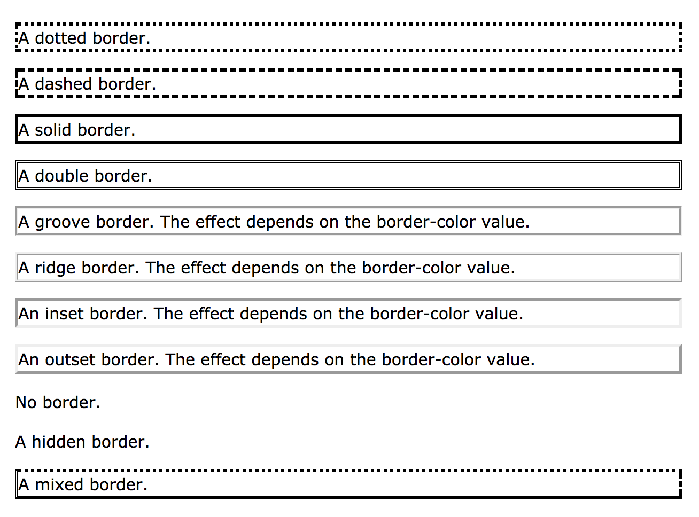

# [CSS](https://www.w3schools.com/css/default.asp)
<!-- MarkdownTOC -->

- [What is CSS](#what-is-css)
- [CSS Synatax](#css-synatax)
    - [CSS Selectors](#css-selectors)
        - [The element Selector](#the-element-selector)
        - [The id Selector](#the-id-selector)
        - [The class Selector](#the-class-selector)
        - [Grouping Selectors](#grouping-selectors)
    - [CSS Comments](#css-comments)
    - [Insert CSS](#insert-css)
        - [External style sheet](#external-style-sheet)
        - [Internal style sheet](#internal-style-sheet)
        - [Inline style](#inline-style)
        - [Multiple Style Sheets](#multiple-style-sheets)
        - [Cascading Order](#cascading-order)
- [CSS Colors](#css-colors)
    - [Color Names](#color-names)
    - [Background Color](#background-color)
    - [Text Color](#text-color)
    - [Border Color](#border-color)
    - [Color Values](#color-values)
        - [RGB Value](#rgb-value)
        - [HEX Value](#hex-value)
        - [HSL Value](#hsl-value)
        - [RGBA Value](#rgba-value)
- [CSS Backgrounds](#css-backgrounds)
    - [Background Color](#background-color-1)
    - [Background Image](#background-image)
        - [Repeat Horizontally or Vertically](#repeat-horizontally-or-vertically)
        - [Set position and no-repeat](#set-position-and-no-repeat)
        - [Fixed position](#fixed-position)
    - [Background - Shorthand property](#background---shorthand-property)
- [CSS Borders](#css-borders)
    - [CSS Border Properties](#css-border-properties)
    - [Border Style](#border-style)
    - [Border Width](#border-width)
    - [Border Color](#border-color-1)
    - [Border - Individual Sides](#border---individual-sides)
    - [Border - Shorthand Property](#border---shorthand-property)
    - [Rounded Borders](#rounded-borders)
- [CSS Margins](#css-margins)
    - [Margin - Individual Sides](#margin---individual-sides)
    - [Margin - Shorthand Property](#margin---shorthand-property)
    - [Margin Collapse](#margin-collapse)
- [CSS Padding](#css-padding)
    - [Paddding - Individual Sides](#paddding---individual-sides)
    - [Padding - Shorthand Property](#padding---shorthand-property)
- [CSS Height/Width](#css-heightwidth)
- [CSS Box Model](#css-box-model)
- [CSS Outline](#css-outline)
    - [Outline - Shorthand property](#outline---shorthand-property)
- [CSS Text](#css-text)
- [CSS Fonts](#css-fonts)
    - [CSS Font Families](#css-font-families)
- [CSS Icons](#css-icons)
    - [Font Awesome Icons](#font-awesome-icons)
    - [Bootstrap Icons](#bootstrap-icons)
    - [Google Icons](#google-icons)
- [CSS Links](#css-links)
- [CSS Lists](#css-lists)
- [CSS Tables](#css-tables)
- [CSS Display](#css-display)
- [CSS Max-width](#css-max-width)
- [CSS Position](#css-position)
- [CSS Overflow](#css-overflow)
- [CSS Float](#css-float)
- [CSS Inline-block](#css-inline-block)
- [CSS Align](#css-align)
- [CSS Combinators](#css-combinators)
- [CSS Pseudo-class](#css-pseudo-class)
- [CSS Pseudo-element](#css-pseudo-element)
- [CSS Opacity](#css-opacity)
- [CSS Navigation Bar](#css-navigation-bar)
- [CSS Dropdowns](#css-dropdowns)
- [CSS Tooltips](#css-tooltips)
- [CSS Image Gallery](#css-image-gallery)
- [CSS Image Sprites](#css-image-sprites)
- [CSS Attr Selectors](#css-attr-selectors)
- [CSS Forms](#css-forms)
- [CSS Counters](#css-counters)
- [CSS Website Layout](#css-website-layout)

<!-- /MarkdownTOC -->


<a name="what-is-css"></a>
## What is CSS
- <b>CSS</b> stands for <b>C</b>ascading <b>S</b>tyle <b>S</b>heets
- CSS describes how HTML elements are to be displayed on screen, paper, or in other media
- CSS saves a lot of work. It can control the layout of multiple web pages all at once
- External stylesheets are stored in <strong>CSS files</strong>

<a name="css-synatax"></a>
## CSS Synatax
- Selector
- Declaration

<a name="css-selectors"></a>
### CSS Selectors

<a name="the-element-selector"></a>
#### The element Selector
The element selector selects elements based on the element name.

```css
p {
    text-align: center;
    color: red;
}
```
<a name="the-id-selector"></a>
#### The id Selector
The id selector uses the id attribute of an HTML element to select a specific element. To select an element with a specific id, write a hash(#) character, folowed by the id of the element.

```css
#paral {
    text-align: center;
    color: red;
}
```

<a name="the-class-selector"></a>
#### The class Selector
- The class selector selects elements with a specific class attribute. 
- To select elements with a specific class, write a period (.) character, followed by the name of the class.
- A class name cannot start with a number!

```css
.center {
    text-align: center;
    color: red;
}
```

You can also specify that only specific HTML elements should be affected by a class.

```css
p.center {
    text-align: center;
    color: red;
}
```

HTML elements can also refer to more than one class.
```html
<p class="center large">This paragraph refers to two classes.</p>

```

<a name="grouping-selectors"></a>
#### Grouping Selectors
```css
h1 {
    text-align: center;
    color: red;
}

h2 {
    text-align: center;
    color: red;
}

p {
    text-align: center;
    color: red;
}
```

equals:

```css
h1, h2, p {
    text-align: center;
    color: red;
}
```

<a name="css-comments"></a>
### CSS Comments
```css
p {
    color: red;
    /* This is a single-line comment */
    text-align: center;
}
/* Thiis is 
a multi-line 
comment */
```
<a name="insert-css"></a>
### Insert CSS
<a name="external-style-sheet"></a>
#### External style sheet
```html
<head>
    <link rel="stylesheet" type="text/css" href="mystyle.css">
</head>
```

mystyle.css:

```css
body {
    background-color: lightblue;
}

h1 {
    color: navy;
    margin-left: 20px;
}
```
<a name="internal-style-sheet"></a>
#### Internal style sheet

```html
<head>
    <style>
        body {
            background-color: linen;
        }

        h1 {
            color: maroon;
            margin-left: 40px;
        }
    </style>
</head>
```
<a name="inline-style"></a>
#### Inline style
```html
<h1 style="color:blue;margin-left: 30px;">
    This is a heading
</h1>
```

<a name="multiple-style-sheets"></a>
#### Multiple Style Sheets
If some properties have been defined for the same selector (element) in different style sheets, the value from the last read style sheet will be used.

<a name="cascading-order"></a>
#### Cascading Order
1. Inline style (inside an HTML element) 
- External and internal style sheets(in the head section)
- Browser default

<a name="css-colors"></a>
## CSS Colors

HTML colors can be specified using predefined color names, RGB, HEX, HSL, RGBA and HSLA values.

<a name="color-names"></a>
### Color Names

[HTML Color Names](https://www.w3schools.com/colors/colors_names.asp)

- Tomato
- Orange
- DodgerBlue
- MediumSeaGreen
- Gray
- SlateBlue
- Violet
- LightGray

<a name="background-color"></a>
### Background Color
```html
<h1 style="background-color:DodgerBlue">Hello World</h1>
<p style="background-color:Tomato">Lorem ipsum...</p>
```

<a name="text-color"></a>
### Text Color
```html
<h1 style="color:Tomato">Hello World</h1>
<p style="color:DodgerBlue">Lorem ipsum...</p>
<p style="color:MediumSeaGreen">Ut wisi ad...</p>
```

<a name="border-color"></a>
### Border Color
```html
<h1 style="border:2px solid Tomato">Hello Wrold</h1>
<h1 style="border:2px solid DodgerBlue">Hello World</h1>
<h1 style="border:2px solid Violet">Hello World</h1>
```
<a name="color-values"></a>
### Color Values
Tomato :

- rgb(255, 99, 71)
- \#ff6347
- hsl(9, 100%, 64)

Tomato with 50% transparent:

- rgba(255, 99, 71, 0.5)
- hsla(9, 100%, 64, 0.5)

<a name="rgb-value"></a>
#### RGB Value
rgb(red, green, blue)

<a name="hex-value"></a>
#### HEX Value
\#rrggbb

<a name="hsl-value"></a>
#### HSL Value
hsl(hue, saturation, lightness)

##### HUE
Hue is a degree on the color wheel from 0 to 360.

- 0 is red
- 120 is green
- 240 is blue

##### Saturation
Saturation can be describe as the intensity of a color.

- 100% is pure color, no shades of gray
- 50% is 50% gray, but you can still see the color.
- 0% is completely gray, you can no longer see the color.

##### Lightness
The lightness off a color can be described as how much light you want to give the color, where 0% means no light(black),50% means 50% light(neither dark nor light) 100% means full lightness(white).

<a name="rgba-value"></a>
#### RGBA Value
rgba(red, green, blue, alpha)

##### Alpha
The alpha parameter is a number between 0.0(fully transparent) and 1.0(not transparent at all)

##### HSLA Value
hsla(hue, saturation, lightness, alpha)

<a name="css-backgrounds"></a>
## CSS Backgrounds
CSS background properties:

- background-color
- background-image
- background-repeat
- background-attachment
- background-position

<a name="background-color-1"></a>
### Background Color

<a name="background-image"></a>
### Background Image 
<a name="repeat-horizontally-or-vertically"></a>
#### Repeat Horizontally or Vertically
By default, the <b>background-image</b> property repeats an image both horizontally and vertically.

```css
body {
    background-image: url("gradient_bg.png");
    /* repeated horizontally */
    background-repeat: repeat-x;
    /* repeated vertically */
    background-repeat: repeat-y;
}
```

<a name="set-position-and-no-repeat"></a>
#### Set position and no-repeat
```css
body {
    background-image: url("img_tree.png");
    background-repeat: no-repeat;
    /* set position */
    background-position: right top;
}
```

<a name="fixed-position"></a>
#### Fixed position
``` css 
body {
    background-image: url("img_tree.png");
    background-repeat: no-repeat;
    background-position: right top;
    /* fixed */ 
    background-attachment: fixed;
}
```

<a name="background---shorthand-property"></a>
### Background - Shorthand property
```css
body {
    background: #ffffff url("img_tree.png") no-repeat right top;
}
```

<a name="css-borders"></a>
## CSS Borders
<a name="css-border-properties"></a>
### CSS Border Properties
The CSS border properties allow you to specify the style, width, and color of an element's border.

<a name="border-style"></a>
### Border Style
The <b>border-style</b> property specifies what kind of border to display.

The following values are allowed:

- dotted
- dashed
- solid
- double
- groove
- ridge
- inset
- outset
- none
- hidden

```css
p.dotted {border-style: dotted;}
p.dashed {border-style: dashed;}
p.solid {border-style: solid;}
p.double {border-style: double;}
p.groove {border-style: groove;}
p.ridge {border-style: ridge;}
p.inset {border-style: inset;}
p.outset {border-style: outset;}
p.none {border-style: none;}
p.hidden {border-style: hidden;}
p.mix {border-style: dotted dashed solid double;}
```

Result:


<a name="border-width"></a>
### Border Width
```css
p.one {
    border-style: solid;
    border-width: 5px;
}

p.two {
    border-style: solid;
    border-width: medium;
}

p.three {
    border-style: solid;
    border-width: 2px 10px 4px 20px;
}
```

<a name="border-color-1"></a>
### Border Color
```css
p.one {
    border-style: solid;
    border-color: red;
}

p.two {
    border-style: solid;
    border-color: green;
}

p.three {
    border-style: solid;
    border-color: red green blue yellow;
}
```

<a name="border---individual-sides"></a>
### Border - Individual Sides
```css
p {
    border-top-style: dotted;
    border-right-style: solid;
    border-bottom-style: dotted;
    border-left-style: solid;
}
```

<a name="border---shorthand-property"></a>
### Border - Shorthand Property
Order:

- border-width
- border-style (required)
- border-color

```css
p {
    border : 5px solid red;
}
```

<a name="rounded-borders"></a>
### Rounded Borders
```css
p {
    border: 2px solid red;
    border-radius: 5px;
}
```

<a name="css-margins"></a>
## CSS Margins
The CSS margin properties are used to generate space around elements.

The margin properties set the size of the white space outside the border.

<a name="margin---individual-sides"></a>
### Margin - Individual Sides
Properties:

- margin-top
- margin-right
- margin-bottom
- margin-left

Values:
- auto - the browser calculates the margin
- length - specifies a margin in px, pt, cm, etc.
- % - specifies a margin in % of the width of the containing element
- inherit - specifies that the margin should be inherited from the parent element

<a name="margin---shorthand-property"></a>
### Margin - Shorthand Property
```css
p {
    margin: 100px 150px 100px 80px;
}

p {
    margin: 25px 30px;
}
```

<a name="margin-collapse"></a>
### Margin Collapse
Top and bottom margins of elements are sometimes collapsed into a single margin that is equal to the largest of the two margins.

```css
h1 {
    margin: 0 0 50px 0;
}

h2 {
    margin: 20px 0 0 0;
}
```

margin h1(bottom)+h2(top) is 50 instead of 70. 


<a name="css-padding"></a>
## CSS Padding
The CSS padding properties are used to generate space around content.

The padding clears an area around the content (inside the border) of an element.

<a name="paddding---individual-sides"></a>
### Paddding - Individual Sides
Properties:

- padding-top
- padding-right
- padding-bottom
- padding-left 

Values:

- length
- %
- inherit

<a name="padding---shorthand-property"></a>
### Padding - Shorthand Property
p {
    padding: 50px 30px 50px 80px;
}

<a name="css-heightwidth"></a>
## CSS Height/Width
height/width :

- auto
- length
- %

- max-height
- max-width
- min-height
- min-width

The max-width property is used to set the maximum width of an element.

max-width's default value is none.

<a name="css-box-model"></a>
## CSS Box Model
Out - <b>Margin</b> - OutLine -Border - <b>Padding</b> - Content

<a name="css-outline"></a>
## CSS Outline
The CSS outline properties specify the style, color, and width of an outline.

<a name="outline---shorthand-property"></a>
### Outline - Shorthand property
```css
p {
    border: 1px solid black;
    outline: 5px dotted red;
}
```

<a name="css-text"></a>
## CSS Text
Properties:

- color
- text-align
    + left
    + right
    + centered
    + justified
- text-decoration
    + none - is often used to remove underlines from links
    + overline
    + line-through
    + underline
- text-transform:
    + uppercase
    + lowercase
    + capitalize
- text-indent: 50px;
- letter-spacing: 3px;
- line-height: 0.8
- direction: rtl; (right to left)
- word-spacing: 10px;
- text-shadow
- text-overflow
- unicode-bidi
- vertical-align
- white-space

<a name="css-fonts"></a>
## CSS Fonts

<a name="css-font-families"></a>
### CSS Font Families
- generic family
    + Serif
    + Sans-serif
    + Monospace
- font-family: The font-family property should hold several font names as a "fallback" system. If the browser does not support the first font, it tries the next font, and so on.
- font-style
    + normal
    + italic
    + oblique
- font-size
    + Absolute size: px; 
    + Relative size: em; The default size of 1em is 16px.
- font-weight
    + normal
    + bold
- font-variant
    + normal
    + small-caps

```css
body {
    font-size: 100%;
}

h1 {
    font-size: 2.5em;
}

h2 {
    font-size: 1.875em;
}

p {
    font-size: 0.875em;
}
```

<a name="css-icons"></a>
## [CSS Icons](https://www.w3schools.com/css/css_icons.asp)
<a name="font-awesome-icons"></a>
### Font Awesome Icons
<link rel="stylesheet" href="https://cdnjs.cloudflare.com/ajax/libs/font-awesome/4.7.0/css/font-awesome.min.css">

<a name="bootstrap-icons"></a>
### Bootstrap Icons
<link rel="stylesheet" href="https://maxcdn.bootstrapcdn.com/bootstrap/3.3.7/css/bootstrap.min.css">

<a name="google-icons"></a>
### Google Icons 
<link rel="stylesheet" href="https://fonts.googleapis.com/icon?family=Material+Icons">

<a name="css-links"></a>
## CSS Links
```css
/* unvisited link */
a:link {
    color: red;
}

/* visited link */
a:visited {
    color: green;
}

/* mouse over link */
a:hover {
    color: hotpink;
}

/* selected link */
a:active {
    color: blue;
}

a:link {
    text-decoration: none;
}

a:visited {
    text-decoration: none;
}

a:hover {
    text-decoration: underline;
}

a:active {
    text-decoration: underline;
}

a:link {
    background-color: yellow;
}

a:visited {
    background-color: cyan;
}

a:hover {
    background-color: lightgreen;
}

a:active {
    background-color: hotpink;
} 

a:link, a:visited {
    background-color: #f44336;
    color: white;
    padding: 14px 25px;
    text-align: center; 
    text-decoration: none;
    display: inline-block;
}

a:hover, a:active {
    background-color: red;
}
```
<a name="css-lists"></a>
## CSS Lists

The CSS list properties allow you to:

- Set different list item markers for ordered lists
- Set different list item markers for unordered lists
- Set an image as the list item marker
- Add background colors to lists and list items

All Properties and values:

- list-style-type
    + circle
    + square
    + upper-roman
    + lower-alpha
    + none : remove the markers/bullets
- list-style-image
    + url('sqpurple.gif');
- list-style-position
- list-style: square inside url("sqpurple.gif");
- background
- padding

```css
ol {
    background: #ff9999;
    padding: 20px;
}

ul {
    background: #3399ff;
    padding: 20px;
}

ol li {
    background: #ffe5e5;
    padding: 5px;
    margin-left: 35px;
}

ul li {
    background: #cce5ff;
    margin: 5px;
}
```

<a name="css-tables"></a>
## CSS Tables
```css
table, th, td {
   border: 1px solid black;
}

table {
    border-collapse: collapse;
    width: 100%;
}

th {
    height: 50px;
    text-align: left;
}

td {
    height: 50px;
    vertical-align: bottom;
}

th, td {
    border-bottom: 1px solid #ddd;
}

th {
    background-color: #4CAF50;
    color: white;
}

tr:hover {background-color: #f5f5f5}
tr:nth-child(even) {background-color: #f2f2f2}
```

<a name="css-display"></a>
## CSS Display

<a name="css-max-width"></a>
## CSS Max-width

<a name="css-position"></a>
## CSS Position

<a name="css-overflow"></a>
## CSS Overflow

<a name="css-float"></a>
## CSS Float

<a name="css-inline-block"></a>
## CSS Inline-block

<a name="css-align"></a>
## CSS Align

<a name="css-combinators"></a>
## CSS Combinators

<a name="css-pseudo-class"></a>
## CSS Pseudo-class

<a name="css-pseudo-element"></a>
## CSS Pseudo-element

<a name="css-opacity"></a>
## CSS Opacity

<a name="css-navigation-bar"></a>
## CSS Navigation Bar

<a name="css-dropdowns"></a>
## CSS Dropdowns

<a name="css-tooltips"></a>
## CSS Tooltips

<a name="css-image-gallery"></a>
## CSS Image Gallery

<a name="css-image-sprites"></a>
## CSS Image Sprites

<a name="css-attr-selectors"></a>
## CSS Attr Selectors

<a name="css-forms"></a>
## CSS Forms

<a name="css-counters"></a>
## CSS Counters

<a name="css-website-layout"></a>
## CSS Website Layout